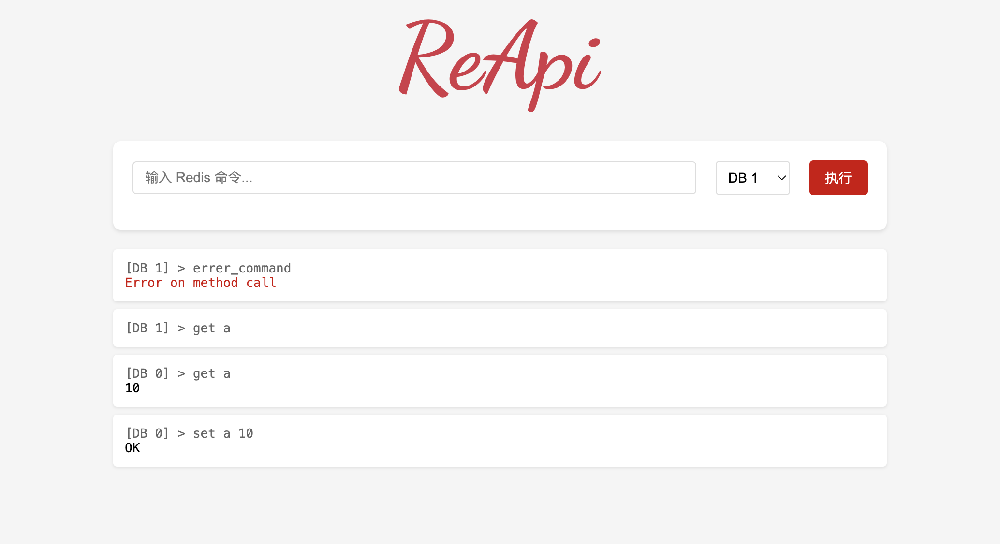

<p align="center">
  <a href="https://github.com/if-nil/reapi" target="_blank" rel="noopener noreferrer">
    
  </a>
</p>

[English](README.md) | 中文

# Redis HTTP API Module (ReAPI)

一个Redis模块，提供HTTP接口来访问Redis命令。通过RESTful API方式调用Redis命令，使得非Redis客户端也能方便地与Redis进行交互。

## 功能特点

- 提供HTTP接口访问Redis命令
- JSON格式响应数据
- 支持所有Redis命令
- 内置Web界面
- 轻量级，易于部署

## 安装

1. 确保你的Redis支持模块功能
2. 编译模块:
```shell
cargo build --release
```
3. 将模块加载到Redis:
```shell
redis-server --loadmodule /path/to/libreapi.so
```

## 配置参数

加载模块时，你可以指定以下参数：

```shell
redis-server --loadmodule /path/to/libreapi.so reapi_host 127.0.0.1 reapi_port 9098
```

| 参数 | 说明 | 默认值 |
|-----------|-------------|---------------|
| reapi_host | ReAPI 服务器绑定的主机地址 | 127.0.0.1 |
| reapi_port | ReAPI 服务器监听的端口号 | 9098 |


## 使用示例

### HTTP API

```shell
# 在默认数据库（DB 0）中设置键值
curl http://127.0.0.1:9098/set/mykey/hello
{"result":"OK"}

# 在数据库 1 中设置键值
curl http://127.0.0.1:9098/1/set/mykey/hello
{"result":"OK"}
```

```shell
# 从默认数据库（DB 0）中获取值
curl http://127.0.0.1:9098/get/mykey
{"result":"hello"}

# 从数据库 1 中获取值
curl http://127.0.0.1:9098/1/get/mykey
{"result":"hello"}
```

```shell
# 执行其他Redis命令
curl http://127.0.0.1:9098/hset/myhash/field1/value1
```

### Web 界面

访问 `http://127.0.0.1:9098` 使用内置的 Web 控制台。你可以：
- 在命令行中输入 Redis 命令
- 从下拉菜单中选择数据库（DB 0-15）
- 执行命令并实时查看结果

[](docs/image/web.png)
